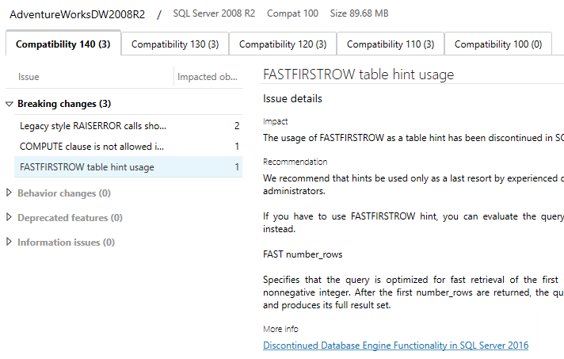

# Instructor Guide for PASS Modern Migration Tour Lab
As described in the [lab scenario document](https://github.com/microsoft/tigertoolbox/blob/master/Sessions/PASS-Modern-Migration-Tour/LabFiles/Lab%20Scenario.md), the purpose of the lab is for the students to upgrade the AdventureWorks application which consists of a single database (AdventureWorksDW2008R2) and a workload. You should have received a .zip file with the following files:

- AdventureWorksDW2008R2_PASSModernMigrationTour.bak
- Cleanup.sql
- ostress.exe
- PostSetup.sql
- PostUpgrade.cmd
- PreSetup.sql
- PreUpgrade.cmd
- Workload.sql

The students will hopefully have come prepared with the prerequisites installed on their laptops. If not, direct them to the [lab setup guide](https://github.com/microsoft/tigertoolbox/blob/master/Sessions/PASS-Modern-Migration-Tour/LabFiles/Lab%20Setup%20Guide.md) on GitHub. Break them up into groups of 2 or more. They will only need one configured laptop per group, so this may help save time if some of the students have not installed the prerequisites.

Instruct the students to restore the AdventureWorksDW2008R2 database using the included .bak file to their 2008R2 instance. At this point, they should read through the scenario and begin planning out their migration strategy. This is an open-ended exercise, they should use what they have learned in the first two sessions to upgrade the database to their SQL Server 2017 instance using the tools they have learned about. Have the students take notes of everything they have done and the steps they have followed as these may be needed to judge the contest in the event of a tie.

Here are the rough steps they should follow to be successful:

1. Run the PreUpgrade.cmd workload file against the SQL Server 2008 R2 instance and make a note of the completion time. This is the baseline performance. 
2. Run the DMA tool against the database on SQL Server 2008 R2. This should reveal 3 breaking changes:

3. Follow the instructions in the DMA tool to change the code of the two stored procedures.
4. Backup the database and restore it on the SQL Server 2017 instance.
5. [Optional] Run the DEA tool against both the 2008 R2 and the 2017 instances using the PreUpgrade.cmd file to generate load. This is not necessarily required, they can just skip to step 6, but students that use the DEA may find more tuning opportunites than those that go with the QTA only. This is where the wiggle room in the contest is.
6. Run the QTA wizard on the SQL Server 2017 instance to create a baseline, upgrade the compatibility level, find tuning opportunities and apply plan guides.
7. Run the PostUpgrade.cmd workload on the SQL Server 2017 instance and make a note of the completion time. Calculate a delta between the two, the student with the greatest improvement in performance wins.

Once these steps have been completed, have the students compare their deltas to see who has made the greatest improvement. If there are ties (or no improvements), ask the students to go through the steps they completed and see which students got closest to the recommended process. You may also want to compare query times using sys.dm_exec_query_stats as there is some variability in how ostress throws load at the system. If there is still no clear winner, use your best judgement :)
