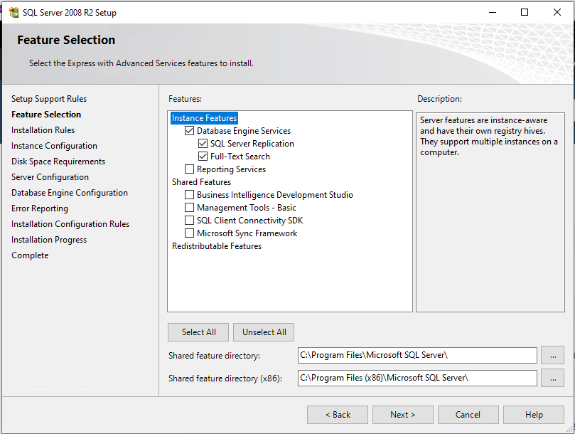
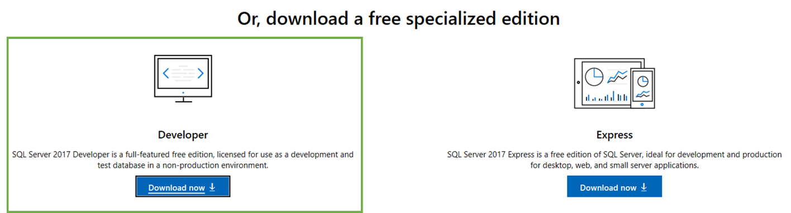
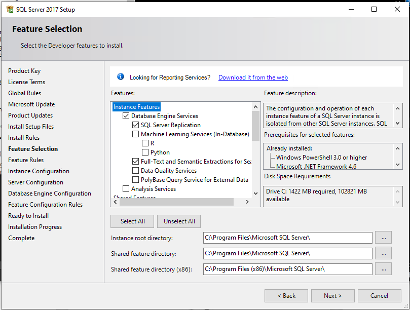

# PASS Modern Migration Tour 2019 Lab Setup Guide

This lab can be executed on any machine that can support both SQL Server 2008 R2 and SQL Server 2017. It is designed to run on a client machine such as your laptop running Windows 10. The entire lab is based on software that can be downloaded for free from Microsoft.

## Lab setup steps
Please complete these steps on your machine prior to attending the workshop, this will help expedite the lab and give you more time to work through the scenario.

1. Download and install [SQL Server 2008 R2 Express Advanced Services](https://www.microsoft.com/en-us/download/details.aspx?id=25174), database engine only:

2. Download and install [SQL Server 2017 Developer](https://www.microsoft.com/en-us/sql-server/sql-server-downloads) edition, database engine only:

3. Download and install [SQL Server Management Studio 18.0](https://docs.microsoft.com/en-us/sql/ssms/download-sql-server-management-studio-ssms?view=sql-server-2017) (SSMS). If you have an earlier version, please upgrade if possible, this version will contain the latest Query Tuning Assistant (QTA) tool.
4. Download and install [Data Migration Assistant v4.3](https://www.microsoft.com/en-us/download/details.aspx?id=53595) (DMA).
5. Download and install [Database Experimentation Assistant 2.6](https://www.microsoft.com/en-us/download/details.aspx?id=54090) (DEA).
6. See your trainer for the scenario supporting files at the start of the lab exercise.

