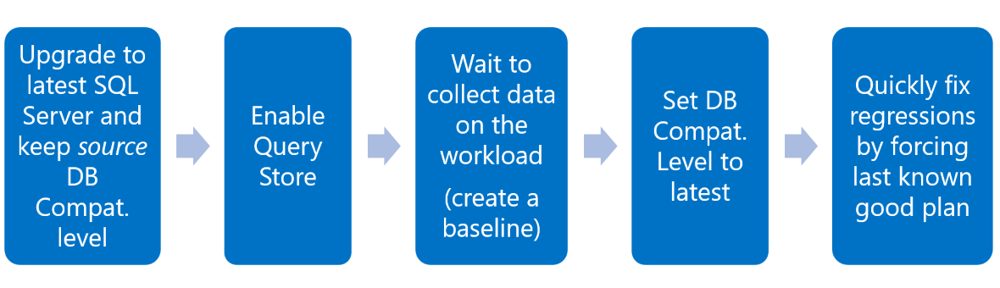
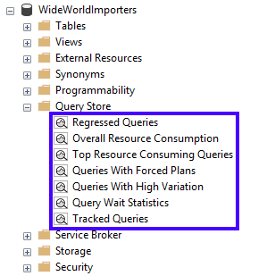

# Auto Tuning Lab 

## Intro - Defining the problem and goal
When migrating from an older version of SQL Server and [upgrading the database compatibility level](https://docs.microsoft.com/sql/relational-databases/databases/view-or-change-the-compatibility-level-of-a-database) to the latest available, a workload may be exposed to the risk of performance regression. 

Starting with SQL Server 2016, all query optimizer changes are gated to the latest database compatibility level, which in combination with Query Store gives you a great level of control over the query performance in the upgrade process if the upgrade follows the recommended workflow seen below. 

 

In SQL Server 2016, users are able to use SSMS Query Store reports to identify **regressed queries** that occur post-database upgrade, and manually force a specific pre-upgrade plan to be used. This maps to the last step in the recommended workflow above. 

 

This control over upgrades was further improved with SQL Server 2017 where [Automatic Tuning](https://docs.microsoft.com/sql/relational-databases/automatic-tuning/automatic-tuning.md) was introduced and allows automating the last step in the recommended workflow above. This lab allows you to see the feature in action.

## Lab requirements (pre-installed)
The following are requirements to run this lab:

- SQL Server 2017 or higher is installed. This feature requires Developer or Enterprise Edition.
- You have installed SQL Server Management Studio or Azure Data Studio.
- You have installed the RML Utilities from https://www.microsoft.com/en-us/download/details.aspx?id=4511. Install ostress from the package *RML_Setup_AMD64.msi*. Add `C:\Program Files\Microsoft Corporation\RMLUtils` to your path variable.
- Restore the WideWorldImporters database to your SQL Server instance. The `WideWorldImporters` database is available in https://github.com/Microsoft/sql-server-samples/tree/master/samples/databases/wide-world-importers.

## Lab

1. Open the folder `C:\Labs\Lab-AutoTuning\SCENARIO` and double-click the file `Scenario.cmd` to execute it. This starts the workload. Leave it running...

2. Setup Performance Monitor on Windows to track `SQL Statistics/Batch Requests/sec` counter. Alternatively, open the file `C:\Labs\Lab-AutoTuning\SCENARIO\Perfmon.htm` with Internet Explorer. Note you may receive a prompt warning that Internet Explorer blocked ActiveX content. Click on **Allow blocked content**. 

    - Once the file opens, click on the green arrow button to **Unfreeze display**.
    - You receive a prompt warning *this action will erase the data in the graph*. Click **Yes** to continue. This resumes the performance counter session previously saved for convenience.
    - Leave it open...

3. While the scenario workload is running, double-click the file `Regression.cmd` in the same folder to execute it. Notice the drop in the *batch requests/sec* counter which means a performance regression was introduced in the workload.

4. Open the file `C:\Labs\Lab-AutoTuning\SCENARIO\recommendations.sql` with SQL Server Management Studio or SQL Operations Studio, execute it and review the results:
    - The time difference under the *reason* column.
    - The value of *state_transition_reason*, which should be ***AutomaticTuningOptionNotEnabled***. This means SQL Server found a regression but is in recommendation mode only, not automatically tuning anything. 
    - The *script* column shows a query that could be used to fix the problem manually.

5. Stop the scenario workload by pressing **CTRL+C**, and then choose **"N"** when prompted to terminate the batch.

6. Now let's see what happens with automatic plan correction which uses this command in SQL Server 2017:

    ```sql
    ALTER DATABASE WideWorldImporters
    SET AUTOMATIC_TUNING ( FORCE_LAST_GOOD_PLAN = ON )
    ```

7. Double-click the file `Auto_tune.cmd`  in the same folder to execute it. This uses the above command to set automatic plan correct ON for WideWorldImporters, and restarts the workload file `Scenario.cmd`.

8. Repeat steps 3-5 as above, and note the following:     
    - In the Performance Monitor window you will see the **Batch Requests/sec** counter dip, but within a second go right back up.    
    This is because SQL Server detected the regression and automatically reverted to the last known good query plan found in the Query Store. 
    - If closed, re-open the file `C:\Labs\Lab-AutoTuning\SCENARIO\recommendations.sql` with SQL Server Management Studio or SQL Operations Studio, execute it and notice the *state_transition_reason* column value is now ***LastGoodPlanForced***.