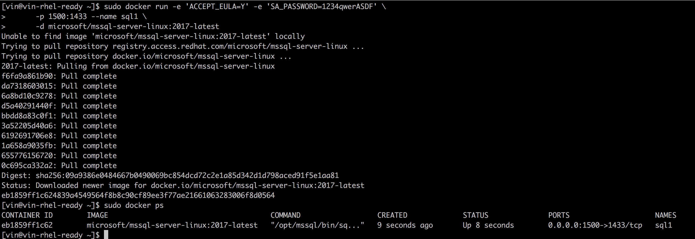
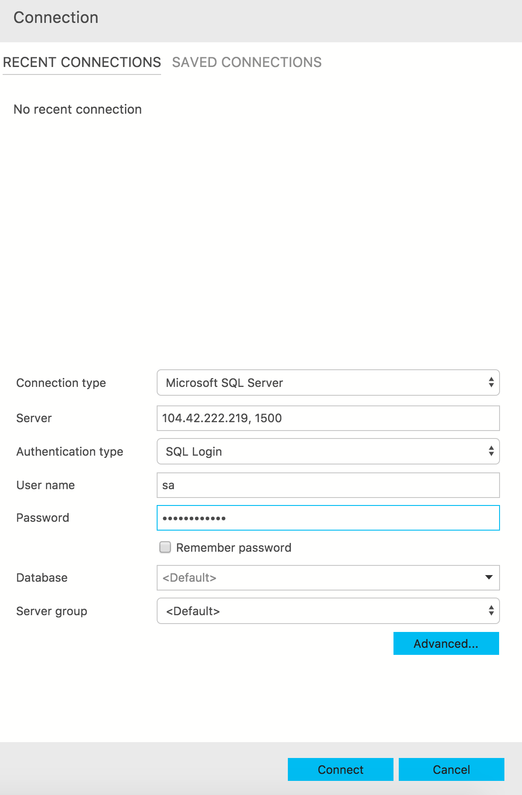
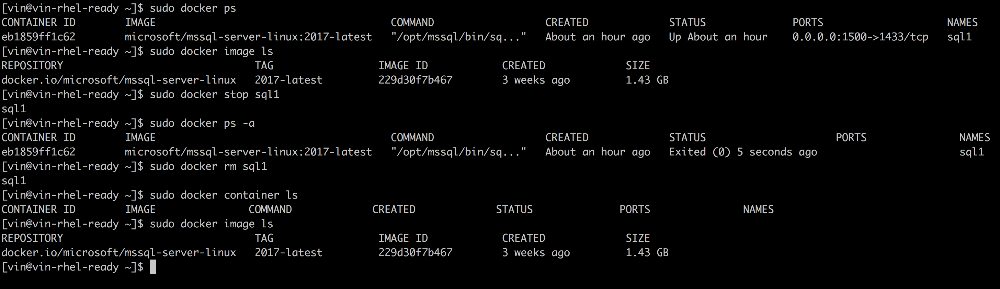
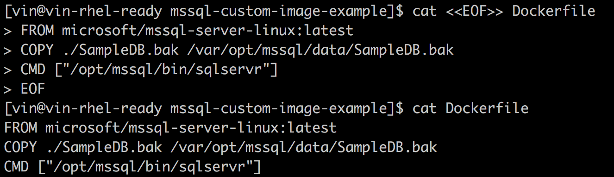
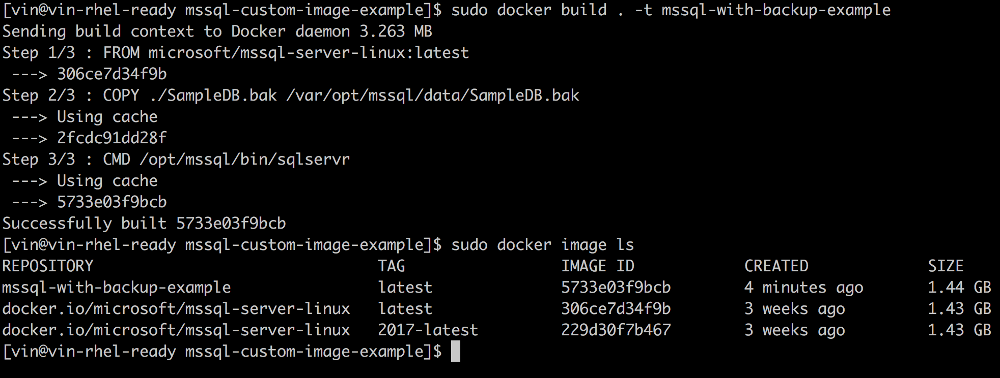
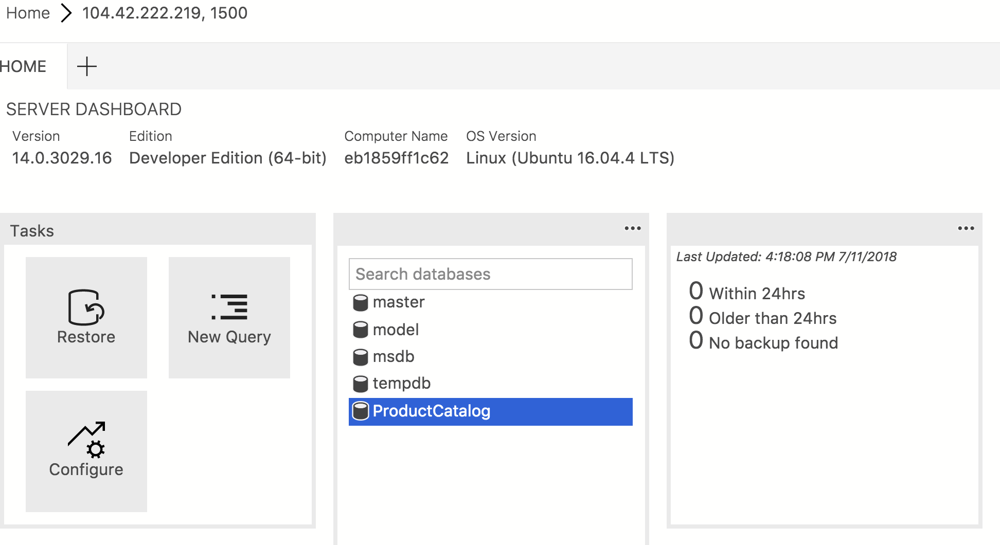
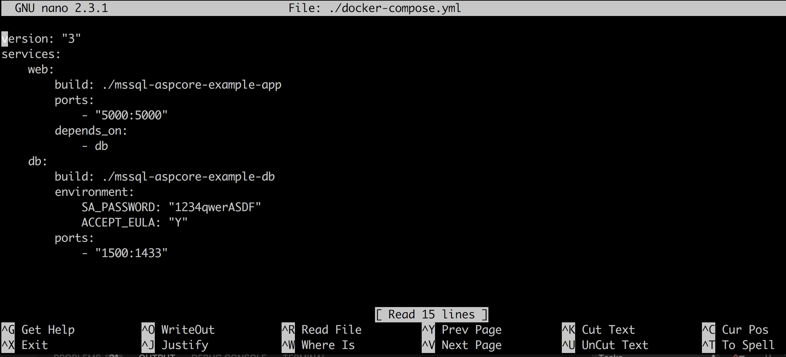
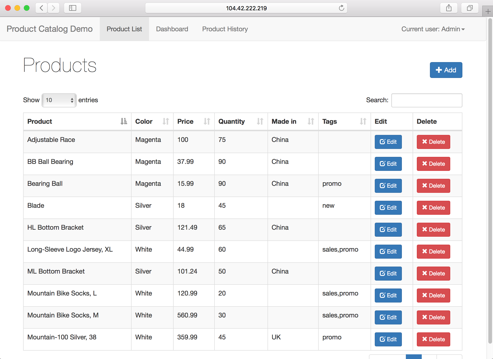

# SQL Server Containers Lab

This lab use the **Putty** program, but you can use any ssh program you want.

## Pre Lab
1. Install docker engine by running the following:


`sudo yum install -y yum-utils device-mapper-persistent-data lvm2`

`sudo yum-config-manager --add-repo https://download.docker.com/linux/centos/docker-ce.repo`

`sudo yum install http://mirror.centos.org/centos/7/extras/x86_64/Packages/pigz-2.3.3-1.el7.centos.x86_64.rpm`

`sudo yum install docker-ce`

check status of docker engine:

`sudo systemctl status docker`

if is not running, start it by running:

`sudo systemctl start docker`

>Note: for this lab, we are installing docker for CentOS, this will work on CentOS or RHEL due to the similarity of the OS’s. For production usage on RHEL, install Docker EE for RHEL: https://docs.docker.com/install/linux/docker-ee/rhel/.
 
2. clone this repo by running the following:

`sudo yum install git`

`git clone https://github.com/Microsoft/tigertoolbox.git`

`unzip tigertoolbox/Sessions/Winter-Ready-2019/Labs/Lab-Containers.zip`

---

## Lab
### 1. Getting started with SQL Server in Containers

#### Introduction
In this section you will run SQL Server in a container and connect to it with SSMS/SQL Operations Studio. This is the easiest way to get started with SQL Server in containers.  
 
#### Steps
1. Change the **SA_PASSWORD** in the command below and run it in your terminal:

      `sudo docker run -e 'ACCEPT_EULA=Y' -e 'SA_PASSWORD=YourStrong!Passw0rd' -p 1500:1433 --name sql1 -d microsoft/mssql-server-linux:2017-latest`

> Tip: edit commands in a text editor prior to pasting in the terminal to easily edit the commands.
>
> Note: By default, the password must be at least 8 characters long and contain characters from three of the following four sets: Uppercase letters, Lowercase letters, Base 10 digits, and Symbols.

 
2. Check that SQL Server is running:

      `sudo docker ps`



3. Connect to SQL Server in container using SSMS or SQL Ops Studio.

Open SSMS or Ops studio and connect to the SQL Server in container instance by connecting host:

`<host IP or name>, 1500`



3. Run SQLCMD inside the container. First run bash interactively in the container with docker execute 'bash' inside 'sql1' container. 

`sudo docker exec -it sql1 bash`

Use SQLCMD within the container to connect to SQL Server:

`/opt/mssql-tools/bin/sqlcmd -U SA -P 'YourStrong!Passw0rd'`


Exit SQLCMD and the container with exit:

`exit`


> **Key Takeaway**
> 
>SQL Server running in a container is the same SQL Server engine as it is on Linux OS or Windows.
 
---

### 2. Explore Docker Basics
#### Introduction
 In this section you'll learn the basics of how to navigate container images and active containers on your host.

#### Steps
Enter the following commands in your terminal.

See the active container instances:

`sudo docker ps`

List all container images:

`sudo docker image ls`

Stop the SQL Server container:

`sudo docker stop sql1`

See that **sql1** is no longer running by listing all containers: 

`sudo docker ps -a`

Delete the container:

`sudo docker rm sql1`

See that the container no longer exists:

`sudo docker container ls`



> **Key Takeaway**
>
> A container is launched by running an image. An **image** is an executable package that includes everything needed to run an application--the code, a runtime, libraries, environment variables, and configuration files.
>
>A **container** is a runtime instance of an image--what the image becomes in memory when executed (that is, an image with state, or a user process). You can see a list of your running containers with the command, docker ps, just as you would in Linux.
> 
> -- https://docs.docker.com/get-started/
 
---

### 3.  Build your own container 

#### Introduction:
In the past, if you were to set up a new SQL Server environment or dev test, your first order of business was to install a SQL Server onto your machine. But, that creates a situation where the environment on your machine might not match test/production.

With Docker, you can get SQL Server as an image, no installation necessary. Then, your build can include the base SQL Server image right alongside any additional environment needs, ensuring that your SQL Server instance, its dependencies, and the runtime, all travel together.

In this section you will build your a own container layered on top of the SQL Server image. 

Scenario: Let's say for testing purposes you want to start the container with the same state. We’ll copy a .bak file into the container which can be restored with T-SQL.  

 
#### Steps:

1. Change directory to the *mssql-custom-image-example folder*.

      `cd containers/mssql-custom-image-example/`


2. Create a Dockerfile with the following contents

```
cat <<EOF>> Dockerfile
FROM microsoft/mssql-server-linux:latest
COPY ./SampleDB.bak /var/opt/mssql/data/SampleDB.bak
CMD ["/opt/mssql/bin/sqlservr"]
EOF
```

3. View the contents of the Dockerfile 

`cat Dockerfile`



4. Run the following to build your container

`sudo docker build . -t mssql-with-backup-example`



5. Start the container by running the following command after replacing **SA_PASSWORD** with your password

```
sudo docker run -e 'ACCEPT_EULA=Y' -e 'SA_PASSWORD=YourStrong!Passw0rd' \
      -p 1500:1433 --name sql2 \
      -d mssql-with-backup-example
```

6. Edit the **-P** with the value used for **SA_PASSWORD** used in the previous command and view the contents of the backup file built in the image:

```
   sudo docker exec -it sql2 /opt/mssql-tools/bin/sqlcmd -S localhost \
   -U SA -P 'YourStrong!Passw0rd' \
   -Q 'RESTORE FILELISTONLY FROM DISK = "/var/opt/mssql/data/SampleDB.bak"' \
   -W \
   | tr -s ' ' | cut -d ' ' -f 1-2
```

the output of this command should be similar to this:

>LogicalName PhysicalName
>----------- ------------
>ProductCatalog /var/opt/mssql/data/ProductCatalog.mdf
>ProductCatalog_log /var/opt/mssql/data/ProductCatalog_log.ldf

7. Edit the **-P** with the value of **SA_PASSWORD** used to start the container and restore the database in the container:

```
sudo docker exec -it sql2 /opt/mssql-tools/bin/sqlcmd \
   -S localhost -U SA -P YourStrong!Passw0rd \
   -Q 'RESTORE DATABASE ProductCatalog FROM DISK = "/var/opt/mssql/data/SampleDB.bak" WITH MOVE "ProductCatalog" TO "/var/opt/mssql/data/ProductCatalog.mdf", MOVE "ProductCatalog_log" TO "/var/opt/mssql/data/ProductCatalog.ldf"'

```

the output of this command should be similar to 

>Processed 384 pages for database 'ProductCatalog', file  'ProductCatalog' on file 1.
>
>Processed 8 pages for database 'ProductCatalog', file 'ProductCatalog_log' on file 1.
>
>RESTORE DATABASE successfully processed 392 pages in 0.278 seconds (11.016 MB/sec).

If you connect to the instance, you should see that the database was restored.
 


7. Clean up the container

`sudo docker stop sql2`

`sudo docker container rm sql2`


> **Key Takeaway**
>
> A **Dockerfile** defines what goes on in the environment inside your container. Access to resources like networking interfaces and disk drives is virtualized inside this environment, which is isolated from the rest of your system, so you need to map ports to the outside world, and be specific about what files you want to “copy in” to that environment. However, after doing that, you can expect that the build of your app defined in this Dockerfile behaves exactly the same wherever it runs.
>
> -- https://docs.docker.com/get-started/part2/#your-new-development-environment
---

### 4. Run a Containerized Application with SQL Server
 
#### Introduction
  
Most applications involve multiple containers. 

#### Steps

1. Install docker-compose:

      `sudo curl -L https://github.com/docker/compose/releases/download/1.21.2/docker-compose-$(uname -s)-$(uname -m) -o /usr/local/bin/docker-compose`

      `sudo chmod +x /usr/local/bin/docker-compose`

      `sudo ln -s /usr/local/bin/docker-compose /usr/bin/docker-compose`


1. Change directory to the mssql-aspcore-example.

`cd containers/mssql-aspcore-example`

>note: if you just finished the **Build your own container** lab, you can navigate to this folder with the following command:
>
> `cd ../mssql-aspcore-example `

2. Open the docker-compose.yml file 

`nano docker-compose.yml`

3. Edit the **SA_PASSWORD** SQL Server environment variables then save the file with **ctrl + x**



4. Edit the **-P** parameter in the **./mssql-aspcore-example-db/db-init.sh** file with the **SA_PASSWORD** that you used in the previous step 

      `nano ./mssql-aspcore-example-db/db-init.sh`


4. Run the containers with docker-compose:

      `sudo docker-compose up`

>note: this will take approx. 15 seconds


5. At this point, you will have two containers up and running: an application container that is able to query the database container. Connect to the 

      `http:<host IP/name>:5000`




To stop the docker compose application, press **ctrl + c** in the terminal. 
To remove the containers run the following command:

`sudo docker-compose down`


### Start-up Explanation

1. Running **docker-compose up** builds/pulls containers and run them with parameters defined in docker-compose.yml
2. The .Net Core application container starts up  
3. The SQL Server container starts up with **entrypoint.sh**

    a. The sqlservr process starts 

    b. A start script is run to apply schema needed by application     

4. The .Net Core application is now able to connect to the SQL Server container with all necessary 


> **Key Takeaway**
>
> **Compose** is a tool for defining and running multi-container Docker applications. With Compose, you use a YAML file to configure your application’s services. Then, with a single command, you create and start all the services from your configuration.
>
> --https://docs.docker.com/compose/overview/
