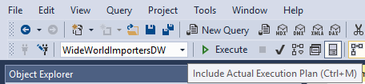
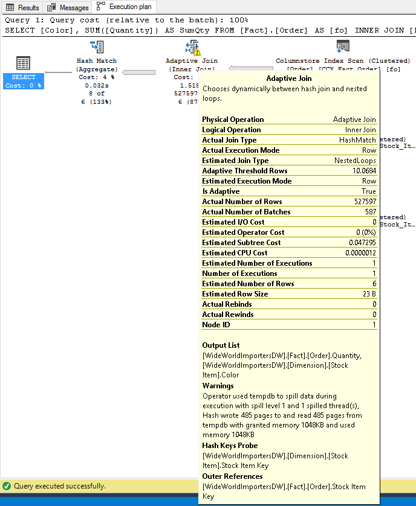
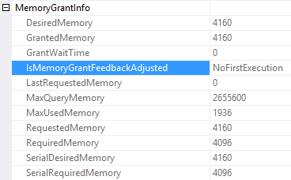
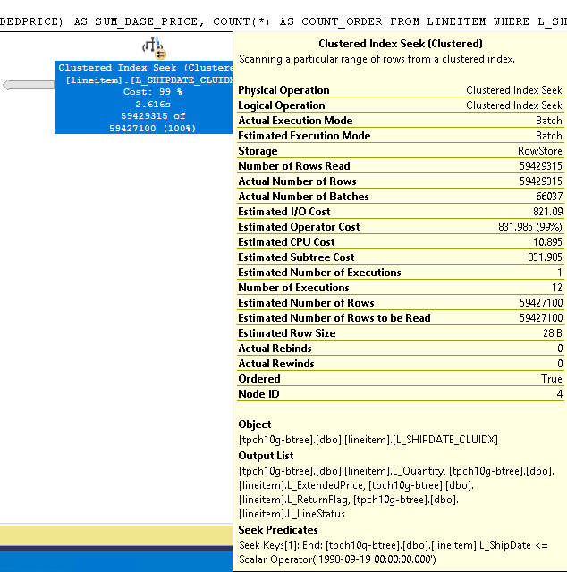
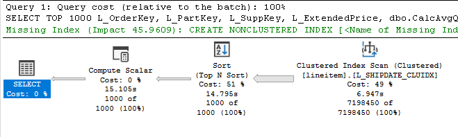
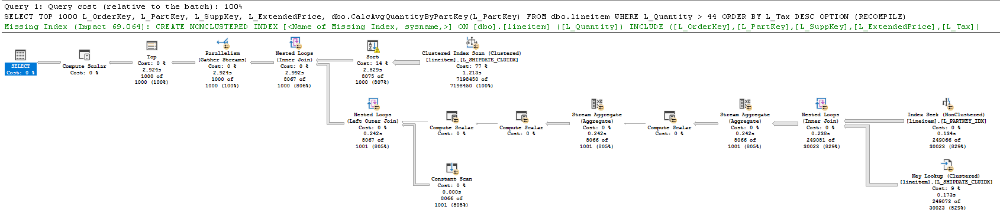
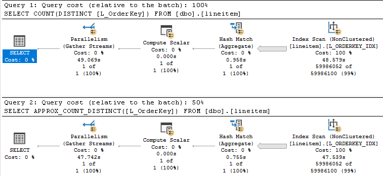
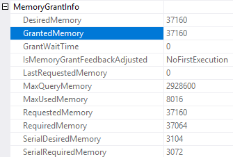

# Intelligent Query Processing Lab 

## Intro - Defining the problem and goal
 [Intelligent query processing in SQL databases](https://docs.microsoft.com/sql/relational-databases/performance/intelligent-query-processing) means that critical parallel workloads improve when running at scale, while remaining adaptive to the constantly changing world of data. 

Intelligent Query Processing is available by default on the latest Database Compatibility Level setting and delivers broad impact that improves the performance of existing workloads with minimal implementation effort.

Intelligent Query Processing in SQL Server 2019 expands upon the Adaptive Query Processing feature family in SQL Server 2017. 

The Intelligent Query Processing suite is meant to rectify some of the common query performance problems by taking some automatic corrective approaches during runtime. It leverages a feedback loop based on statistics collected from past executions to improve subsequent executions.  

 

## Lab requirements (pre-installed)
The following are requirements to run this lab:

- SQL Server 2019 is installed. 
- You have installed SQL Server Management Studio.
- Restore the **tpch** and **WideWorldImportersDW** databases to your SQL Server instance. The `WideWorldImportersDW` database is available in https://github.com/Microsoft/sql-server-samples/tree/master/samples/databases/wide-world-importers. The **tpch** database can be procured at http://www.tpc.org.

## Lab

### Exercise 1 - Batch Mode Memory Grant Feedback (MGF)

Queries may spill to disk or take too much memory based on poor cardinality estimates. MGF will adjust memory grants based on execution feedback, and remove spills to improve concurrency for repeating queries. In SQL Server 2017, MGF was only available for BatchMode (which means Columnstore had to be in use). In SQL Server 2019 and Azure SQL DB, MGF was extended to also work on RowMode which means it's available for all queries running on SQL Server Database Engine.

1. Open SSMS and connect to the SQL Server 2019 instance (default instance). Click on **New Query** or press CTRL+N.

     

2. Setup the database to ensure the latest database compatibility level is set, by running the commands below in the query window:

    ```sql
    USE master;
    GO

    ALTER DATABASE WideWorldImportersDW 
	SET COMPATIBILITY_LEVEL = 150;
    GO

    ALTER DATABASE SCOPED CONFIGURATION CLEAR PROCEDURE_CACHE;
    GO
    ```

3. Simulate an outdated statistics scenario and create a stored procedure, by running the commands below in the query window:

    ```sql
    USE WideWorldImportersDW;
    GO
    
    UPDATE STATISTICS [Fact].[Order] 
    WITH ROWCOUNT = 1, PAGECOUNT = 1;
    GO

    CREATE OR ALTER PROCEDURE dbo.StockItems
    AS
    SELECT [Color], SUM([Quantity]) AS SumQty
    FROM [Fact].[Order] AS [fo]
    INNER JOIN [Dimension].[Stock Item] AS [si] 
        ON [fo].[Stock Item Key] = [si].[Stock Item Key]
    GROUP BY  [Color];
    GO
    ```

4. For the next steps, looking at the query execution plan is needed. Click on **Include Actual Plan** or press CTRL+M.

     

5. Execute the stored procedure once, by running the command below in the query window: 

    ```sql
    EXEC dbo.StockItems;
    ```

6. Notice the query execution plan, namely the yellow warning sign over the join. Hovering over exposes a number of properties such as the details of a spill to TempDB, which slowed down the query's performance. Spills happen when the granted query memory was not enough to process entirely in memory.

     

7. Right-click the query execution plan root node - the **SELECT** - and click on **Properties**.     
    In the ***Properties*** window, expand **MemoryGrantInfo**. Note that:
    - The property ***LastRequestedMemory*** is zero because this is the first execution. 
    - The current status of whether this query has been adjusted by MGF is exposed by the ***IsMemoryGrantFeedbackAdjusted*** property. In this case value is **NoFirstExecution**. This means there was no adjustment because it is the 1st time the query is executing.

     

8. Execute the stored procedure again. 

9. Click on the query execution plan root node - the **SELECT**. Observe:
    - The ***IsMemoryGrantFeedbackAdjusted*** property value is **YesAdjusting**.
    - The ***LastRequestedMemory*** property is now populated with the previous requested memory grant. 
    - The ***GrantedMemory*** property is greater than the ***LastRequestedMemory*** property. This indicates that more memory was granted, although the spill might still occur, which means SQL Server is still adjusting to the runtime feedback.

10. Execute the stored procedure again, and repeat until the yellow warning sign over the join disappears. This will indicate that there are no more spills. Then execute one more time.

11. Click on the query execution plan root node - the **SELECT**. Observe:
    - The ***IsMemoryGrantFeedbackAdjusted*** property value is **YesStable**.
    - The ***GrantedMemory*** property is now the same as the ***LastRequestedMemory*** property. This indicates that the optimal memory grant was found and adjusted by MGF.

Note that different parameter values may also require different query plans in order to remain optimal. This type of query is defined as **parameter-sensitive**. For parameter-sensitive plans (PSP), MGF will disable itself on a query if it has unstable memory requirements over a few executions.

---

### Exercise 2 - Table Variable (TV) Deferred Compilation

Table Variables are suitable for small intermediate result sets, usually no more than a few hundred rows. However, if these constructs have more rows, the legacy behavior of handling a TV is prone to performance issues.    

The legacy behavior mandates that a statement that references a TV is compiled along with all other statements, before any statement that populates the TV is executed. Because of this, SQL Server estimates that only 1 rows would be present in a TV at compilation time.    

Starting with SQL Server 2019, the behavior is that the compilation of a statement that references a TV that doesn’t exist is deferred until the first execution of the statement. This means that SQL Server estimates more accurately and produces optimized query plans based on the actual number of rows in the TV in its first execution.

1. Open SSMS and connect to the SQL Server 2019 instance (default instance). Click on **New Query** or press CTRL+N.

     

2. Setup the database to ensure the database compatibility level of SQL Server 2017 is set, by running the commands below in the query window:

    > **Note:**
    > This ensures the database engine behavior related to Table Variables is mapped to a version lower than SQL Server 2019.

    ```sql
    USE master;
    GO

    ALTER DATABASE [tpch10g-btree] 
    SET COMPATIBILITY_LEVEL = 140;
    GO
    ```

3. For the next steps, looking at the query execution plan is needed. Click on **Include Actual Plan** or press CTRL+M.

     

4. Execute the command below in the query window: 

    > **Note:**
    > This should take between 1 and 5 minutes.

    ```sql
    USE [tpch10g-btree];
    GO

    DECLARE @LINEITEMS TABLE 
	(
        L_OrderKey INT NOT NULL,
	    L_Quantity INT NOT NULL
	);

    INSERT @LINEITEMS
    SELECT TOP 750000 L_OrderKey, L_Quantity
    FROM dbo.lineitem
    WHERE L_Quantity = 43;

    SELECT O_OrderKey, O_CustKey, O_OrderStatus, L_QUANTITY
    FROM ORDERS, @LINEITEMS
    WHERE O_ORDERKEY = L_ORDERKEY
        AND O_OrderStatus = 'O';
    GO
    ```

5. Observe the shape of the query execution plan, that it is a serial plan, and that Nested Loops Joins were chosen given the estimated low number of rows.

6. Click on the **Table Scan** operator in the query execution plan, and hover your mouse over the operator. Observe:
    - The ***Actual Number of Rows*** is 750000.
    - The ***Estimated Number of Rows*** is 1. 
    This indicates the legacy behavior of misusing a TV, with the huge estimation skew.

     


7. Setup the database to ensure the latest database compatibility level is set, by running the commands below in the query window:

    > **Note:**
    > This ensures the database engine behavior related to Table Variables is mapped to SQL Server 2019.

    ```sql
    USE master;
    GO

    ALTER DATABASE [tpch10g-btree] 
    SET COMPATIBILITY_LEVEL = 150;
    GO
    ```

8. Execute the same command as step 5. 

9. Observe the shape of the query execution plan now, that it is a parallel plan, and that a single Hash Joins was chosen given the estimated high number of rows.

10. Click on the **Table Scan** operator in the query execution plan, and hover your mouse over the operator. Observe:
    - The ***Actual Number of Rows*** is 750000.
    - The ***Estimated Number of Rows*** is 750000. 
    This indicates the new behavior of TV deferred compilation, with no estimation skew and a better query execution plan, which also executed much faster (~20 seconds).

     

---

### Exercise 3 - Batch Mode on Rowstore

The query optimizer has (until now) considered batch-mode processing only for queries that involve at least one table with a Columnstore index. SQL Server 2019 is introducing **Batch Mode on Rowstore**, which means that use of columnstore indexes is not a condition to use batch mode processing anymore.    

However, Batch Mode is especially useful when processing large number of rows such as analytical queries, which means users won't be seeing Batch Mode used on every query. A rough initial check involves table sizes, operators used, and estimated cardinalities in the input query. Additional checkpoints are used, as the optimizer discovers new, cheaper plans for the query. And if plans do not make significant use of batch mode, the optimizer will stop exploring batch mode alternatives.

1. Open SSMS and connect to the SQL Server 2019 instance (default instance). Click on **New Query** or press CTRL+N.

     

2. Setup the database to ensure the latest database compatibility level is set, by running the commands below in the query window:

    > **Note:**
    > This ensures the database engine behavior related to Table Variables is mapped to SQL Server 2019.

    ```sql
    USE master;
    GO

    ALTER DATABASE [tpch10g-btree] 
    SET COMPATIBILITY_LEVEL = 150;
    GO

    USE [tpch10g-btree];
    GO
    
    ALTER DATABASE SCOPED CONFIGURATION CLEAR PROCEDURE_CACHE;
    GO
    ```

3. For the next steps, looking at the query execution plan is needed. Click on **Include Actual Plan** or press CTRL+M.

     

4. Execute the command below in the query window: 

    > **Note:**
    > The hint forces row mode and should take about 1 to 2 minutes.

    ```sql
    SELECT L_RETURNFLAG,
        L_LINESTATUS,
        SUM(L_QUANTITY) AS SUM_QTY,
        SUM(L_EXTENDEDPRICE) AS SUM_BASE_PRICE,
        COUNT(*) AS COUNT_ORDER
    FROM LINEITEM
    WHERE L_SHIPDATE <= dateadd(dd, -73, '1998-12-01')
    GROUP BY L_RETURNFLAG,
            L_LINESTATUS
    ORDER BY L_RETURNFLAG,
            L_LINESTATUS
    OPTION (RECOMPILE, USE HINT('DISALLOW_BATCH_MODE'));
    ```

5. Observe the query execution plan and note there is no columnstore in use.     
    Click on the **Clustered Index Seek** operator in the query execution plan, and hover your mouse over the operator. Observe:
    - The ***Actual Number of Rows*** is over 59 Million.
    - The ***Estimated Number of Rows*** is the same. This indicates no estimation skews.
    - The ***Actual Execution Mode*** and ***Estimated Execution Mode*** show "Row", with ***Storage*** being "RowStore".

      

6. Execute the command below in the query window: 

    ```sql
    SELECT L_RETURNFLAG,
        L_LINESTATUS,
        SUM(L_QUANTITY) AS SUM_QTY,
        SUM(L_EXTENDEDPRICE) AS SUM_BASE_PRICE,
        COUNT(*) AS COUNT_ORDER
    FROM LINEITEM
    WHERE L_SHIPDATE <= dateadd(dd, -73, '1998-12-01')
    GROUP BY L_RETURNFLAG,
            L_LINESTATUS
    ORDER BY L_RETURNFLAG,
            L_LINESTATUS
    OPTION (RECOMPILE);
    ```

7. Observe query execution plan and note there is still no columnstore in use.    
    Click on the **Clustered Index Seek** operator in the query execution plan, and hover your mouse over the operator. Observe:
    - The ***Actual Number of Rows*** and ***Estimated Number of Rows*** remain the same as before. Over 59 Million rows.
    - The ***Actual Execution Mode*** and ***Estimated Execution Mode*** show "Batch", with ***Storage*** still being "RowStore". 
    This indicates the new behavior of allowing eligible queries to execute in Batch Mode over Rowstore, whereas up to SQL Server 2017 this was only allowed over Columnstore. It also executed much faster (~3 seconds).

     

---

### Exercise 4 - Scalar UDF Inlining 

User-Defined Functions that are implemented in Transact-SQL and return a single data value are referred to as T-SQL Scalar User-Defined Functions. T-SQL UDFs are an elegant way to achieve code reuse and modularity across SQL queries, and help in building up complex logic without requiring expertise in writing complex SQL queries.

However, Scalar UDF can introduce performance issues in workloads. Here are a few reasons why:

- **Iterative invocation**: Invoked once per qualifying row. Repeated context switching – and even worse for UDFs that execute SQL queries in their definition
- **Lack of costing**: Scalar operators are not costed (realistically).
- **Interpreted execution**: Each statement itself is compiled, and the compiled plan is cached. No cross-statement optimizations are carried out.
- **Serial execution**: SQL Server does not allow intra-query parallelism in queries that invoke UDFs.

In SQL Server 2019, the ability to inline Scalar UDFs means we can enable the benefits of UDFs without the performance penalty, for queries that invoke scalar UDFs where UDF execution is the main bottleneck. Using query rewriting techniques, UDFs are transformed into equivalent relational expressions that are “inlined” into the calling query with which the query optimizer can work to find more efficient plans.

> **Note:**
> Not all T-SQL constructs are inlineable, such as when the UDF is:
> - Invoking any intrinsic function that is either time-dependent (such as `GETDATE()`) or has side effects (such as `NEWSEQUENTIALID()`)
> - Referencing table variables or table-valued parameters
> - Referencing scalar UDF call in its `GROUP BY` clause
> - Natively compiled (interop is supported)
> - Used in a computed column or a check constraint definition
> - References user-defined types
> - Used in a partition function

> **Important:**
> If a scalar UDF is inlineable, it does not imply that it will always be inlined. SQL Server will decide (on a per-query, per-UDF basis) whether to inline a UDF or not.

1. Open SSMS and connect to the SQL Server 2019 instance (default instance). Click on **New Query** or press CTRL+N.

     

2. Setup the database to ensure the latest database compatibility level is set, by running the commands below in the query window:

    > **Note:**
    > This ensures the database engine behavior related to Table Variables is mapped to SQL Server 2019.

    ```sql
    USE master;
    GO

    ALTER DATABASE [tpch10g-btree] 
    SET COMPATIBILITY_LEVEL = 150;
    GO

    USE [tpch10g-btree];
    GO
    
    ALTER DATABASE SCOPED CONFIGURATION CLEAR PROCEDURE_CACHE;
    GO
    ```

3. Create a UDF that does data access, by running the commands below in the query window:

    ```sql
    CREATE OR ALTER FUNCTION dbo.CalcAvgQuantityByPartKey
        (@PartKey INT)
    RETURNS INT
    AS
    BEGIN
            DECLARE @Quantity INT

            SELECT @Quantity = AVG([L_Quantity])
            FROM [dbo].[lineitem]
            WHERE [L_PartKey] = @PartKey

            RETURN (@Quantity)
    END
    GO
    ```

4. For the next steps, looking at the query execution plan is needed. Click on **Include Actual Plan** or press CTRL+M.

     

5. Execute the command below in the query window: 

    > **Note:**
    > The hint forcibly disables UDF inlining and should take between 20 and 30 seconds.

    ```sql
    SELECT TOP 1000
        L_OrderKey,
        L_PartKey,
        L_SuppKey,
        L_ExtendedPrice,
        dbo.CalcAvgQuantityByPartKey(L_PartKey)
    FROM dbo.lineitem
    WHERE L_Quantity > 44
    ORDER BY L_Tax DESC
    OPTION (RECOMPILE,USE HINT('DISABLE_TSQL_SCALAR_UDF_INLINING'));
    ```

6. Observe the query execution plan shape and note:
    - The overall elapsed time.
    - The time spent on each operator. 
    - The fact that the plan executed in serial mode.
    - The **Compute Scalar** operator obfuscates the logic inside, and the estimated cost is low, as evidenced by the estimated cost of zero percent as it relates to the entire plan.

     

7. Now execute the command below in the query window: 

    ```sql
    SELECT TOP 1000
        L_OrderKey,
        L_PartKey,
        L_SuppKey,
        L_ExtendedPrice,
        dbo.CalcAvgQuantityByPartKey(L_PartKey)
    FROM dbo.lineitem
    WHERE L_Quantity > 44
    ORDER BY L_Tax DESC
    OPTION (RECOMPILE);
    ```

8. Observe the query execution plan shape and note:
    - The overall elapsed time dropped.
        > **Note:**
        > The metrics you observed are for a first time execution only and because the hint **RECOMPILE** is used.
        > Removing the hint **RECOMPILE** and executing the same statements multiple times should yield lower execution times, while maintaining the relative performance difference. 

    - The plan has inlined all the logic that was obfuscated by the UDF in the previous plan. 
    - The fact that the plan executed in parallel.
    - The Database Engine was able to identify a potentially missing index with a higher projected impact, precisely because it was able to inline the UDF.
    - The inlined scalar UDF allowed us to see there is a **SORT** operator that is spilling. MGF can resolve this after a few executions if the hint **RECOMPILE** wasn't used.

     

---

### Exercise 5 - Approximate QP

Obtaining row counts serves numerous dashboard-type scenarios. When these queries are executed against big data sets with many distinct values (for example, distinct orders counts over a time period) – and many concurrent users, this may introduce performance issues, increased resource usage such as memory, and blocking.

For some of these scenarios, approximate data is good enough. For example for data scientists doing big data set exploration and trend analysis. There's a need to understand data distributions quickly but exact values are not paramount.

SQL Server 2019 introduces the ability to do approximate `COUNT DISTINCT` operations for big data scenarios, with the benefit of high performance and a (very) low memory footprint.

> **Important:**
> Approximate QP does NOT target banking applications or any scenario where an exact value is required! 

1. Open SSMS and connect to the SQL Server 2019 instance (default instance). Click on **New Query** or press CTRL+N.

     

2. Setup the database to ensure the latest database compatibility level is set, by running the commands below in the query window:

    ```sql
    USE master;
    GO

    ALTER DATABASE [tpch10g-btree] 
    SET COMPATIBILITY_LEVEL = 150;
    GO

    USE [tpch10g-btree];
    GO
    
    ALTER DATABASE SCOPED CONFIGURATION CLEAR PROCEDURE_CACHE;
    GO
    ```

3. Now execute the commands below in the query window: 

    ```sql
    DBCC DROPCLEANBUFFERS;
    GO
    SELECT COUNT(DISTINCT [L_OrderKey])
    FROM [dbo].[lineitem];
    GO

    DBCC DROPCLEANBUFFERS;
    GO
    SELECT APPROX_COUNT_DISTINCT([L_OrderKey])
    FROM [dbo].[lineitem];
    GO
    ```

4. Observe the query execution plan shape and note:
    - The plans look exactly the same.
    - Execution time is very similar.

     


5. Right-click *Query 1* execution plan root node - the **SELECT** - and click on **Properties**.     
    In the ***Properties*** window, expand **MemoryGrantInfo**. Note that:
    - The property ***GrantedMemory*** is almost 3 GB. 
    - The property ***MaxUsedMemory*** is almost 700 MB.

     

6. Now right-click *Query 2* execution plan root node - the **SELECT** - and click on **Properties**.     
    In the ***Properties*** window, expand **MemoryGrantInfo**. Note that:
    - The property ***GrantedMemory*** is just under 40 MB. 
    - The property ***MaxUsedMemory*** is about 8 MB.

     

    > **Important:**
    > This means that for scenarios where approximate count is enough, with the much lower memory footprint, these types of queries can be executed often with less concerns about concurrency and memory resource bottlenecks.

7. If you would execute again but removing the `DBCC DROPCLEANBUFFERS` command, because pages are cached now, the queries would be much faster, but still equivalent in the above observations.

    ```sql
    SELECT COUNT(DISTINCT [L_OrderKey])
    FROM [dbo].[lineitem];
    GO

    SELECT APPROX_COUNT_DISTINCT([L_OrderKey])
    FROM [dbo].[lineitem];
    GO
    ```

    