# Deploy and Explore SQL Server on Linux Lab


This lab will walk you through the basics of deploying SQL Server and command line tools on Linux using Red Hat Enterprise Linux (RHEL). Then you will go through a few exercises to get more familiar with Linux, connect to SQL Server on Linux with tools, and learn to use the mssql-conf script.

You should have a RHEL in an Azure Virtual Machine and installed an ssh client, SQL Operations Studio, and SQL Server Management Studio (Windows clients only).

You can watch a demonstration of this lab on YouTube at <https://youtu.be/7vLBHzE7CuI>

## Deploy SQL Server on Linux

Run all of the following commands from your ssh session with the bash shell. This lab assumes your Linux Server is connected to the internet. You can do an offline installation of SQL Server on Linux. See the documentation at <https://docs.microsoft.com/sql/linux/sql-server-linux-setup#offline>

1. Copy the repository configuration file using the following command

    `sudo curl -o /etc/yum.repos.d/mssql-server.repo https://packages.microsoft.com/config/rhel/7/mssql-server-2017.repo`

    The repository configuration file is a text file that contains the location of the SQL Server package for RHEL. This repo file will point to the latest Cumulative Update for SQL Server 2017 on Linux. See our documentation for how to use a repository file for other branches <https://docs.microsoft.com/sql/linux/sql-server-linux-change-repo>

    With a good internet connection this should take a few seconds. The output will look something like the following

    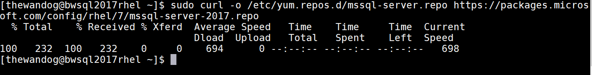

2. Use the yum package manager to kick off the installation with the following command (-y means don't prompt)

    `sudo yum install -y mssql-server`

    This will take longer as the package is around 170Mb. When this has successfully completed, your session should look like this

    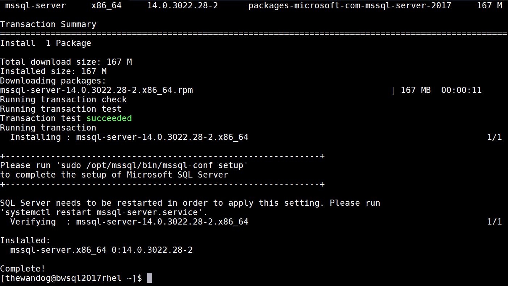

3. Now you must complete the installation by executing a bash shell script we install called **mssql-conf** (which uses a series of python scripts). We will also use mssql-conf later to perform a configuration task for SQL Server. Execute the following command

    `sudo /opt/mssql/bin/mssql-conf setup`

    Go through the prompts to pick Edition (choose Developer or Enterprise Core for these labs), accept the EULA, and put in the sa password (must meet strong password requirements like SQL Server on Windows). Remember the sa password as you will use it often in the labs.

    When mssql-conf is complete, your session should look something like this

    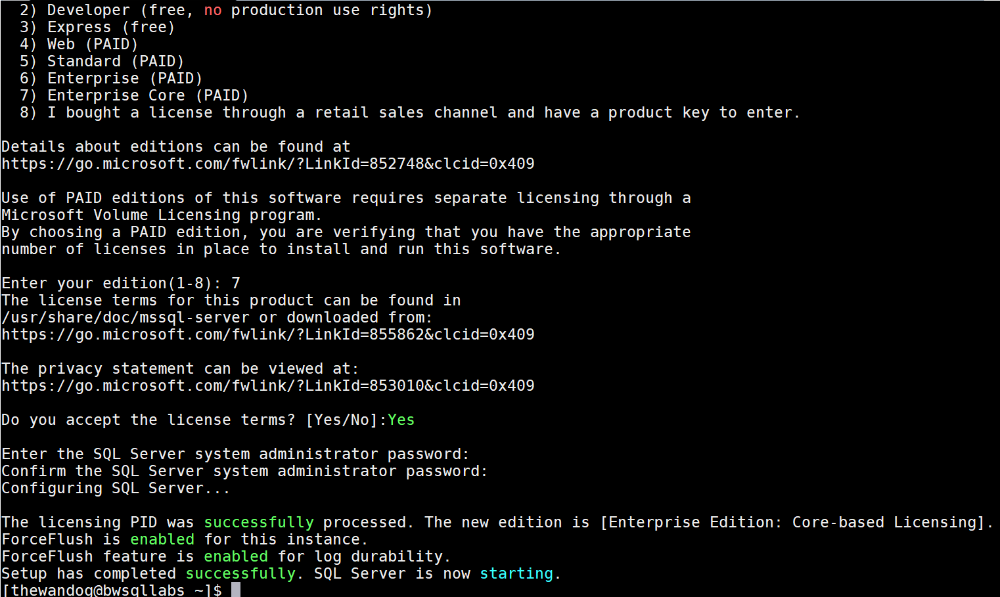

4. Open up the firewall on Linux for the SQL Server port by running the following two commands

    `sudo firewall-cmd --zone=public --add-port=1433/tcp --permanent`

    `sudo firewall-cmd --reload`

Believe it or not, that's it! You have now installed SQL Server on Linux which includes the core database engine and SQL Server Agent.

## Explore the SQL Server installation

Now that you have completed the basic deployment, let's explore what has been installed.

1. Let's prove SQL Server is really installed and running by executing the following command

    `sudo systemctl status mssql-server`

    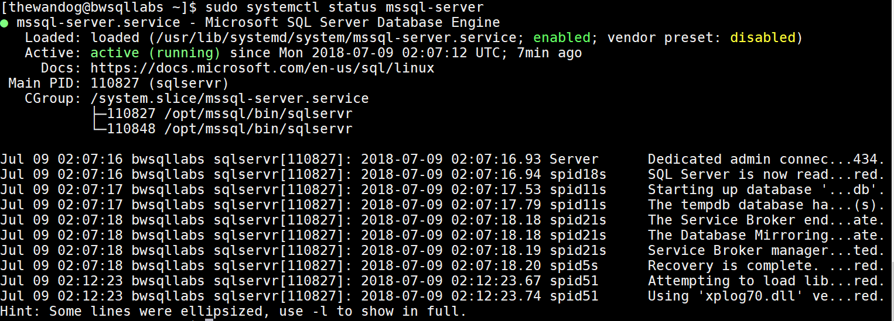

    SQL Server is installed as a systemd unit which is like a service on Windows. **systemctl** is used to report on the status and control the service.

    Note in this output two PID values under Cgroup: in this output. We launch two processes for sqlservr on Linux. The top one is the parent which forks the child. The child process is the main SQL Server engine.

    You can also see the bottom of the ERRORLOG displayed when running this command

2. Run the following commands to test stopping, starting, and restarting SQL Server

    `sudo systemctl stop mssql-server`

    `sudo systemctl status mssql-server`

    `sudo systemctl start mssql-server`

    `sudo systemctl status mssql-server`

    `sudo systemctl restart mssql-server`

    `sudo systemctl status mssql-server`

    Note that there are no return values when starting, stopping, or restarting. You must run systemctl status to check on the status of SQL Server. With each start of SQL Server, you should see different PID values (for new processes).

3. Let's see where everything is installed. Run the following command to see where the binaries are installed

    `sudo ls -l /opt/mssql/bin`

    This directory contains the sqlservr executable, mssql-conf script, and other files to support crash dumps. There is no method today to change the location of these files.

4. Run these commands to see where the default directories for databases and ERRORLOG log (and other log files) are stored

    `sudo ls -l /var/opt/mssql/data`

    `sudo ls -l /var/opt/mssql/log`

    Note from the results that the owner of these files is mssql and mssql. This is a group and non-interactive user called mssql which is the context under which sqlservr executes. Any time sqlservr needs to read or write a file, that file or directory must have mssql:mssql permissions. There is no method to change this today. You can change the default locations of database files, backups, transaction log files, and the ERRORLOG directory using the mssql-conf script.

5. Let's dump out the current ERRORLOG file using a command on Linux called **cat** (and another variation using **more** so you can page the results)

    `sudo cat /var/opt/mssql/log/errorlog`

    `sudo more /var/opt/mssql/log/errorlog`

## Learn common Linux commands

Let's learn a few common Linux commands while interacting with the bash shell

1. Find out information about the computer running Linux by running the following command

    `sudo dmidecode -t 1`

    On Azure Virtual Machine, the output should look like the following

    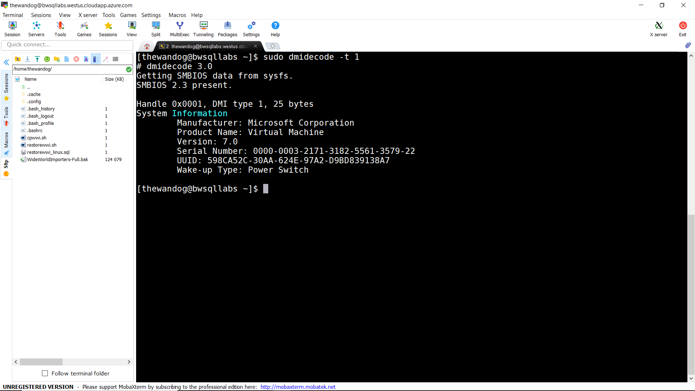

2. Find out information about the Linux distribution by running the following command

    `cat /etc/*-release`

3. Find out information about memory configured on the Linux Server by running the following command

    `cat /proc/meminfo`

    The **MemTotal** is the total amount of physical memory on the Linux Server

    The /proc directory is known as the *proc filesystem* and there is other interesting information exposed in files in this directory.

4. Find out about the number of cores, sockets, NUMA nodes, and chip architecture by running the following command

    `lscpu`

5. The **ps** command is used to view all processes on the Linux Server. Use this command to scroll through all processes including parent/child process relationships

    `ps axjf | more`

6. Run the following command to see a list of disks and mounted file systems on these disks including disk sizes

    `df -H`

    On my Azure Virtual Machine, the output looks like the following

    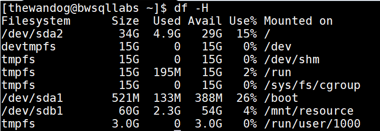

    The disk starting with /dev are the true disks for the server.

7. To see basic performance information by process run the following command

    `top`

    **top** will sort the results with the process using the most CPU at the top which since nothing else is running is sqlservr

    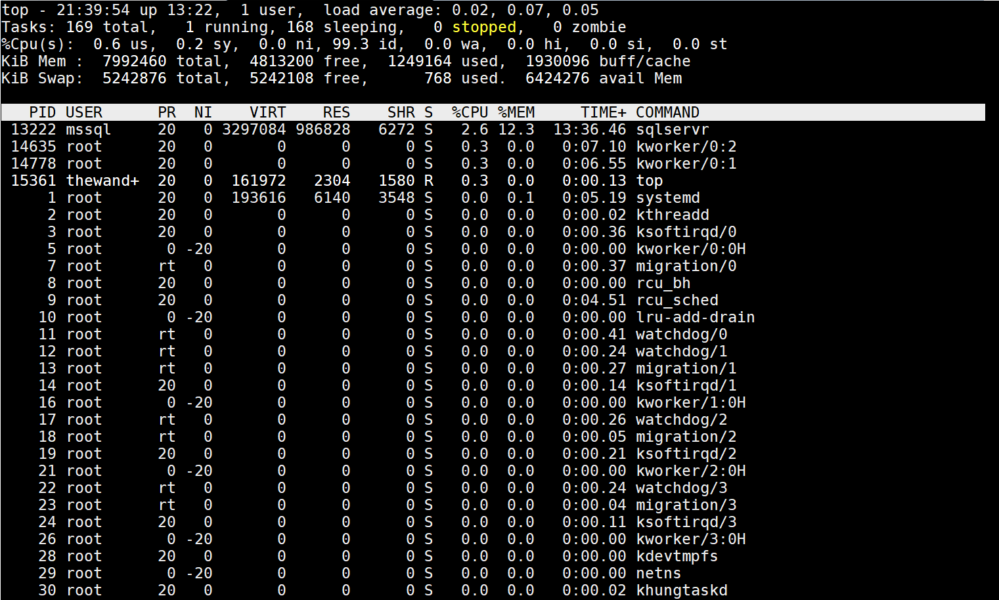

    The **KiB Mem** values show physical total, free, and used memory.  
    The **RES** column is the amount of physical memory used by a process like sqlservr.  

    **top** is interactive so type in "q" to quit the program 

8. **iotop** is a utility to monitor I/O statistics per process. However, it is not installed by default. Run the following command to first install iotop

    `sudo yum install -y iotop`

    Now run the following command to execute iotop

    `sudo iotop`

    This shows the overall I/O on the system plus I/O per process. Type in "q" to exit the program. Run this version of the command to only view I/O for processes actually using I/O. This program is interactive and refreshes itself every few seconds

    `sudo iotop -o`

    There are many other options with iotop. Execute the command `man iotop` to experiment with all iotop options.

9. **htop** is an interactive program to see process utilization information across processors and processes. However, it is not installed by default so run the following commands first to install htop.

    `sudo wget dl.fedoraproject.org/pub/epel/7/x86_64/Packages/e/epel-release-7-11.noarch.rpm`

    `sudo rpm -ihv epel-release-7-11.noarch.rpm`

    `sudo yum install -y htop`

    Now run the interactive htop command to observe its display

    `htop`

    Here is what htop looks like on my Azure Virtual Machine

    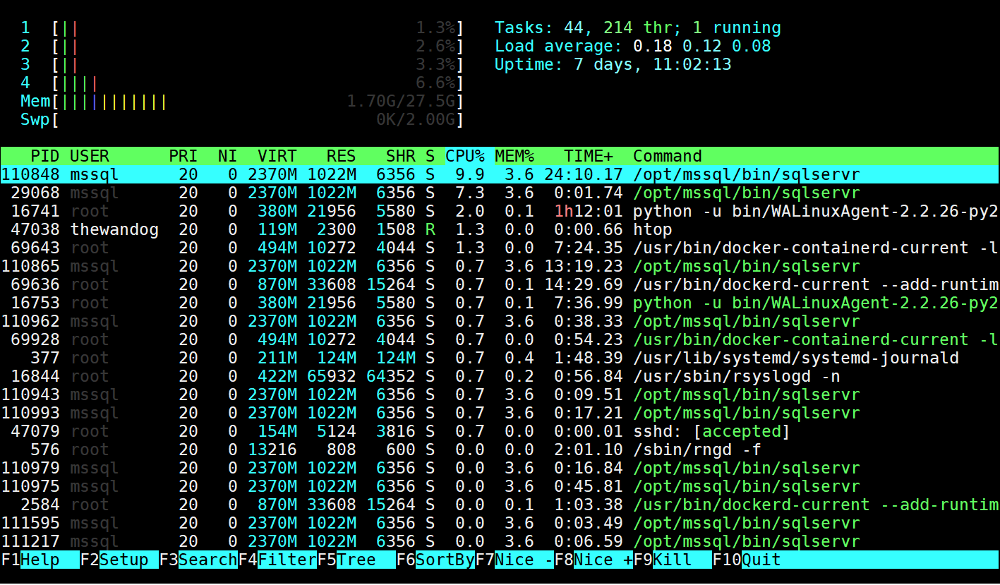

    Type "q" to exit the tool

10. You will likely need a good editor while using Linux. While the editor vi is installed by default, I recommend you use the **nano** editor. It may be already installed but if not run the following command to install it

    `sudo yum install -y nano`

    Let's use nano to create a shell script to run on Linux

    `nano dumperrorlog.sh`

    nano is a full screen editor. Type in the following in the editor window

    `sudo cat /var/opt/mssql/log/errorlog`

    Type Ctrl+X to exit. You will get prompted to save the file

    Run the following command to make the script executable

    `chmod u+x dumperrorlog.sh`

    Now execute the script

    `./dumperrorlog.sh`

## Install SQL Server command line tools on Linux

SQL Server on Linux supports both natively compiled command line tools like **sqlcmd** and open source, cross-platform command line tools such as **mssql-cli**. In this section you will go through the process of installing these tools and performing a quick test to confirm they work. Run all of the following commands from your ssh session with the bash shell. This lab assumes your Linux Server is connected to the internet, but there are pointers in each section for an offline install.

### Install sqlcmd on Linux

Let's install the SQL command line tools including sqlcmd (Note: you can also install the tools offline per the following documentation <https://docs.microsoft.com/sql/linux/sql-server-linux-setup-tools#offline-installation)>)

1. Change to superuser mode by running the following command

    `sudo su`

2. Run the following command to download the repository configuration file for tools

    `curl https://packages.microsoft.com/config/rhel/7/prod.repo > /etc/yum.repos.d/msprod.repo`

3. Exit superuser mode

    `exit`

4. Install the ODBC driver and sql command line tools packages

    `sudo yum install mssql-tools unixODBC-devel`

5. Make sqlcmd accessible in your PATH by executing the following commands

    `echo 'export PATH="$PATH:/opt/mssql-tools/bin"' >> ~/.bash_profile`

    `source ~/.bash_profile`

6. Run a quick test to connect with sqlcmd by executing the following

    `sqlcmd -Usa -Slocalhost`

    Put in your sa password. At the sqlcmd prompt, run the following T-SQL statement

    ```sql
    SELECT @@VERSION
    GO
    ```

    You should get results similar to the following (Your version could vary depending on the latest Cumulative Update available)

    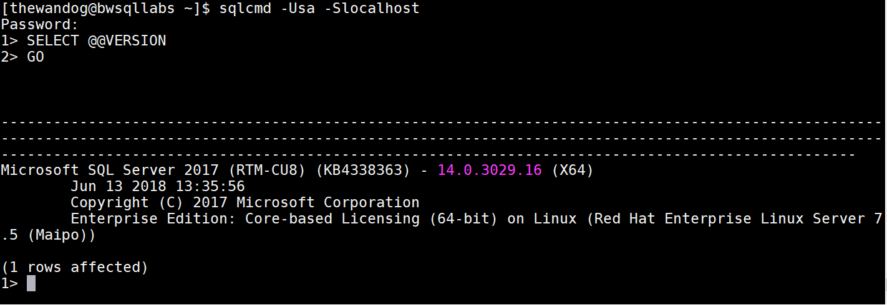

    Type in "exit" to quit sqlcmd

## Install mssql-cli on Linux

You will perform the same tasks to install the new open source, cross-platform tool **mssql-cli**, which is built on python. This tool is in preview as of July 2018. To perform the installation offline, check the documentation at <https://github.com/dbcli/mssql-cli/blob/master/doc/installation/linux.md#red-hat-enterprise-linux-rhel-7>

1. Import a repository key by running the following command

    `sudo rpm --import https://packages.microsoft.com/keys/microsoft.asc`

2. Pull down the repository file for mssql-cli by running the following command

    `curl https://packages.microsoft.com/config/rhel/7/prod.repo | sudo tee /etc/yum.repos.d/microsoft.repo`

3. Install the package using yum with the following command

    `sudo yum install -y mssql-cli`

4. Now test mssql-cli like we did for sqlcmd by running the following command

    `mssql-cli -Usa -Slocalhost`

5. You should get a new prompt like sqlcmd. At this prompt type in the following T-SQL command and hit Enter

    ```sql
    SELECT @@VERSION
    ```

    Notice as you started typing you see Intellisense functionality kick-in which is one of the differences from sqlcmd.

    Your results should look like the following (again your version may be different depending on which Cumulative Update version was available when you installed SQL Server)

    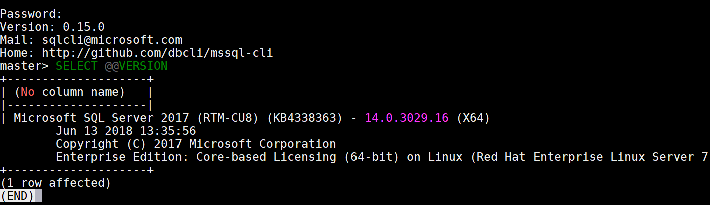

    If you are not put back into the mssql-cli prompt, type "q" to get back to the prompt.

    mssql-cli does not recognize the "GO" keyword as sqlcmd does. Use a ";" to separate batches. You can also hit F3 to type statements in multiple lines but they will all be in one batch.

    Type in "exit" to quit mssql-cli

## Restore a database

Now you will learn the great compatibility story of SQL Server on Linux by restoring a backup from SQL Server on Windows to SQL Server on Linux. And you will interact with this database using sqlcmd and mssql-cli. This section of the lab assumes your Linux Server is connected to the internet. If you are not connected to the internet, you can download the database to restore from <https://github.com/Microsoft/sql-server-samples/releases/download/wide-world-importers-v1.0/WideWorldImporters-Full.bak> and then copy it to your Linux Server (MobaXterm drag and drop is really nice for this)

1. From your Linux ssh session, run the following command from the bash shell

     `wget https://github.com/Microsoft/sql-server-samples/releases/download/wide-world-importers-v1.0/WideWorldImporters-Full.bak`

    Depending on your network speed this should take no more than a few minutes

2. Copy and restore the WideWorldImporters database. Copy the **restorewwi_linux.sql** files from **c:\Labs\Labs-Linux** into your home directory on Linux. MobaXterm provides drag and drop capabilities to do this. Copy these files and drop them into the "explorer" pane in MobaXterm on the left hand side from your ssh session.

3. Copy the backup file to the SQL Server directory so it can access the file and change permissions on the backup file by executing the following command in the bash shell

    `sudo cp WideWorldImporters-Full.bak /var/opt/mssql`

    `sudo chown mssql:mssql /var/opt/mssql/WideWorldImporters-Full.bak`

4. Now restore the database by executing the following command from the bash shell

    `/opt/mssql-tools/bin/sqlcmd -Usa -irestorewwi_linux.sql`

6. When this command completes successfully the output in your ssh session should look like the following

    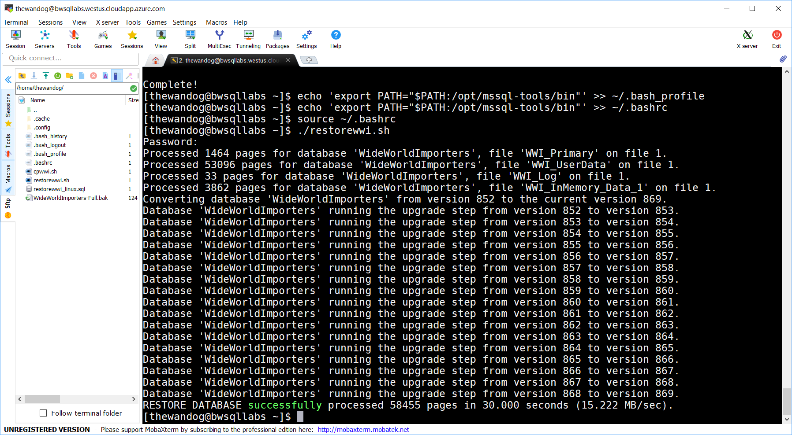

7. Connect with sa to run a query against this database. Run sqlcmd first to connect. Type in the sa password when prompted

    `sqlcmd -Usa -Slocalhost`

8. From the sqlcmd prompt run these commands

    ```sql
    USE WideWorldImporters
    GO
    SELECT * FROM [Sales].[Customers]
    GO
    ```

    The results flash by so it is difficult to see the rows from this table like the following

    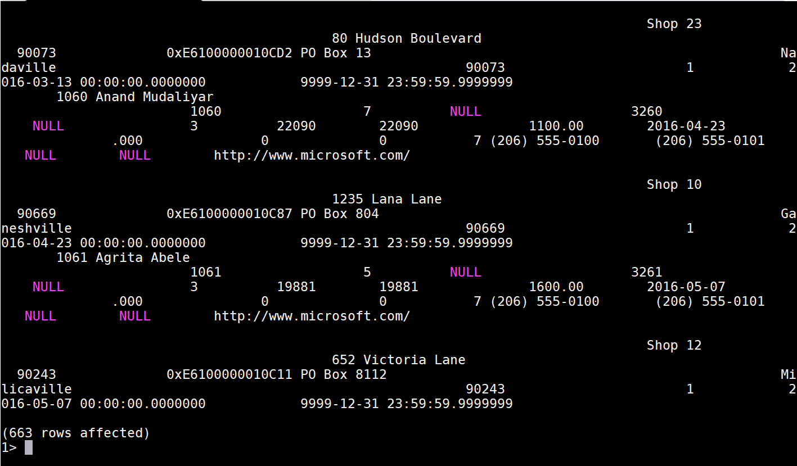

    Type in "exit" to quit sqlcmd

9. Now run the same set of commands using mssql-cli. Connect to SQL Server with mssql-cli. Type in the sa password when prompted

    `mssql-cli -Usa -Slocalhost`

10. Run the following T-SQL commands from the msql-cli prompt (BONUS: Use Intellisense to complete these queries)

    `USE WideWorldImporters;SELECT * FROM Sales.Customers;`

    See how mssql-cli by default will present rows in a vertical record format. Hit Enter or Space to keep paging as many rows as you like. Your results should look like the following

    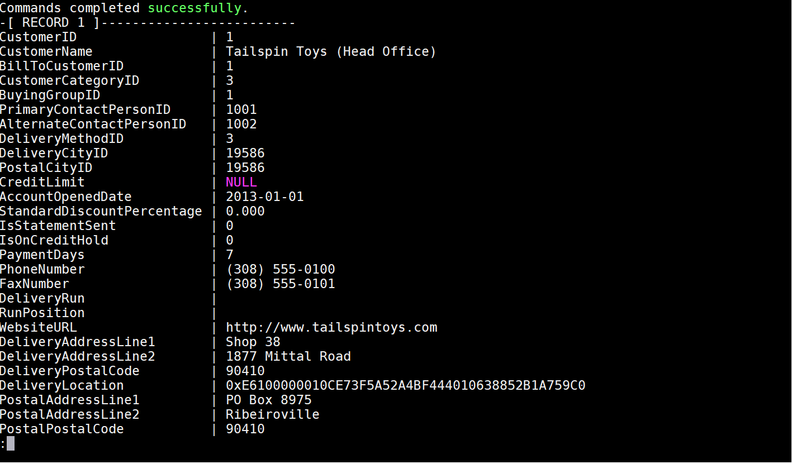

    Type in "q" at any time to get back to the prompt and "exit" to quit mssql-cli

## Use mssql-conf to set a traceflag

There may be situations where you need to enable a traceflag as global and at SQL Server startup time. For Windows, this is done through the SQL Server Configuration Manager. For SQL Server on Linux, you will use the mssql-conf script. A list of all documented traceflags can be found at <https://docs.microsoft.com/sql/t-sql/database-console-commands/dbcc-traceon-trace-flags-transact-sql>.

Let's say you wanted to enable trace flag 1222 for deadlock details to be reported in the ERRORLOG.

1. Run the following command from an ssh session with the bash shell

    `sudo /opt/mssql/bin/mssql-conf traceflag 1222 on`

    When this succeeds you will get a message that SQL Server needs to be restarted like the following

    

2. Per these instructions, restart SQL Server with the following command:

    `sudo systemctl restart mssql-server`

    Note: If this is successful, the command just returns to the shell prompt

3. Verify the trace flag was properly set by looking at the ERRORLOG with the following command

    `sudo more /var/opt/mssql/log/errorlog`

    The ERRORLOG should show -T 1222 as a startup parameter like the following

    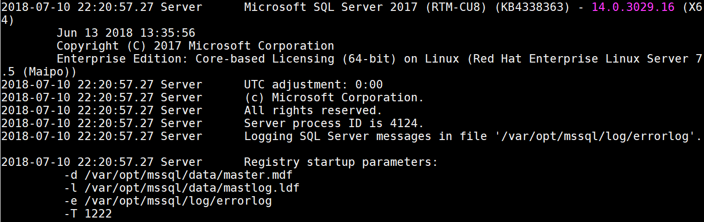

4. BONUS: Use sqlcmd or mssql-cli to verify this trace flag is set by running the following T-SQL statement

    ```sql
    DBCC TRACESTATUS(-1)
    ```

    The results should show that trace flag 1222 is setup globally like the following

    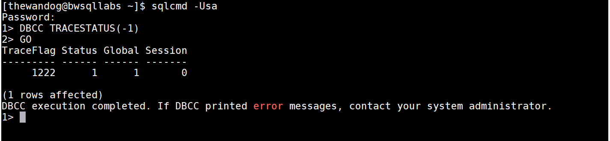

## Existing familar tools like SQL Server Management Studio (SSMS) just work!

In this lab, if you are using a Windows client, see how SQL Server Management Studio (SSMS) works "as is" against a SQL Server on Linux.

1. Connect with SQL Server Management Studio using SQL Authentication with the sa account and the server name for your Linux Server. If the server is running on Azure Virtual Machine use the full DNS name from the portal like bwsqllabs.westus.cloudapp.azure.com

2. Use Object Explorer and the Query Editor just like you would a normal SQL Server instance. Go through some of the steps in the SSMS tutorial in our documentation at <https://docs.microsoft.com/sql/ssms/tutorials/tutorial-sql-server-management-studio>
