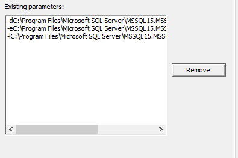

# SQL Server 2019 Memory-Optimized TempDB Lab

1.  Connect to the Windows VM in Azure using the information provided in the LODS portal instructions. If you are performing this lab in your own environment, create a VM with a minimum of 32 cores and SQL Server 2019 CTP 2.3.

2.  Open SQL Server Management Studio (SSMS) and connect to the **HkTempDBTestVM\\SQL2019\_CTP23** instance. Verify that the **AdventureWorks** database exists. If it does not, perform the following steps:

    1.  Open and execute the script `C:\Labs\MemoryOptimizedTempDB\00-AdventureWorks_Setup.sql`.    
        This will restore the AdventureWorks database and make configuration changes needed for the rest of the lab.

    2.  Open and execute the script `C:\Labs\MemoryOptimizedTempDB\01-SalesAnalysis_Optimized.sql` to create the **SalesAnalysis\_Optimized** stored procedure.

3.  Verify that there are no startup trace flags set:

    1.  Open **SQL Server Configuration Manager**.

    2.  Click "SQL Server Services" in the left pane.

    3.  Right-Click "SQL Server (SQL2019\_CTP23)" and choose
        ***Properties***.

    4.  Click the ***Startup Parameters*** tab.

    5.  Verify that there are no lines that being with "-T" in the list of existing parameters:    

        

        If any exist, highlight them and click "Remove".

    6.  Click "OK" to close the *Properties* window, then click "OK" on the Warning box that pops up.

    7.  Restart the SQL Server service by right-clicking on "SQL Server (SQL2019\_CTP23)" and choosing **Restart**.

4.  Browse to the `C:\Labs\MemoryOptimizedTempDB` folder and double-click the file `SQL2019_CTP23_PerfMon.htm` file to open it in Internet Explorer.    
    
    - Once the file opens, right-click anywhere in the white area of the window to clear the existing data.
    - You will receive a prompt warning *this action will erase the data in the graph*.    
        Click **Yes** to continue, then click **Clear** to clear the window in preparation for the lab.
    - Leave it open...

5.  In SSMS, open the following script files:

    - `02-get waiting tasks and executing command.sql`
    - `02-get summary of current waits.sql`
    - `02-get object info from page resource sql 2019.sql`

    These will be used to monitor the server while the workload is running.

6.  Start the workload:

    1.  Open a Command Prompt and browse to `C:\Labs\MemoryOptimizedTempDB`

    2.  Go back to the Internet Explorer window that has the Performance Monitor collector open and click the play button (green arrow) to start the collection.

    3.  From the Command Prompt window, execute `SQL2019_CTP23_Run_SalesAnalysis_Optimized.bat` by typing or pasting the file name and hitting **Enter**.

7.  While the workload is running, watch the counters in Performance Monitor. You should see **Batch Requests/sec** around 500 and there should be **Page Latch** waits throughout the workload.    
    
    You can then go to SSMS and run the various scripts to monitor the workload.   You should see several sessions waiting on `PAGELATCH`, and when using the `02-get object info from page resource sql 2019.sql` you should see the sessions are waiting on pages that belong to TempDB system tables, most often `sysschobjs`.    
    This is TempDB metadata contention and is the scenario that this SQL Server 2019 improvement is targeted to correct.    
    
    Feel free to run the workload a few more times to examine the different scripts and performance counters. Each time you run it, the runtime will be reported in the Command Prompt window. It should take about 1 minute to run each time.

8.  Once you have finished examining the contention, make sure the Command Prompt scripts are complete and pause the Performance Monitor collection. We'll use the same Performance Monitor window for the next part of the lab, so it's a good idea to have at least one collection of the workload on the screen when you pause it in order to compare before and after the change.

9.  Turn on Memory-Optimized TempDB:

    1. Open **SQL Server Configuration Manager**.
    2. Click "SQL Server Services" in the left pane.
    3. Right-Click "SQL Server (SQL2019\_CTP23)" and choose ***Properties***.
    4. Click the ***Startup Parameters*** tab.
    5. In the "Specify a startup parameter:" box, type "-T3895" and click the "Add" button.
    6. The "Existing parameters:" box should now look like this:
    
       

    7. Click "OK" to close the *Properties* window, then click "OK" on the Warning box that pops up.
    8. Restart the SQL Server service by right-clicking on "SQL Server (SQL2019\_CTP23)" and choosing **Restart**.

10. Go back to the Performance Monitor collector and click play to start the collection.

11. Start the workload the same way you did in Step 5.

12. Again, watch the Performance Monitor counters. You should see **Batch Requests/sec** higher this time, around 600, and there should be no Page Latch waits.   

    > **Note:**
    > You may see a small bump of Page Latch waits the first time you run the workload after the restart. This should disappear the second time you run it.

    Running the scripts from step 6 during the workload should show that no sessions are waiting for any resources. Again, feel free to run the workload multiple times. It should run faster this time, around 52 seconds vs. 1 minute.

    > **Note:**
    > The amount of improvement you will see on a real-world workload will depend on how much contention is seen and the size of the SQL Server (i.e. how many cores and how much memory).     
    > Small servers without a high level of concurrency will not see much of an improvement, if any at all.     
    > This improvement is designed to provide greater scalability, so while a single run won't get much faster, you should be able to run a lot more concurrent threads without increasing the runtime of each batch.
