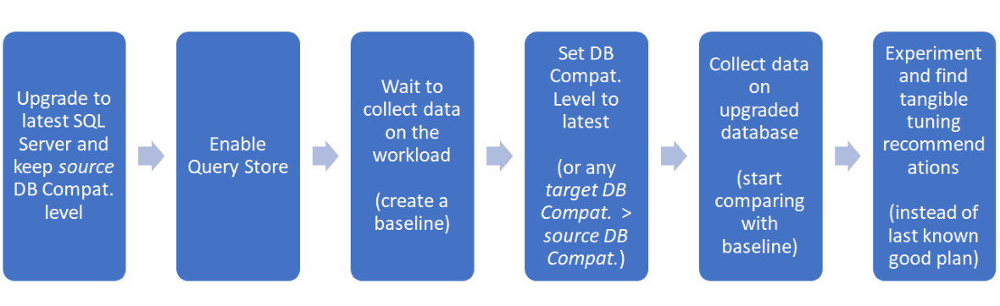
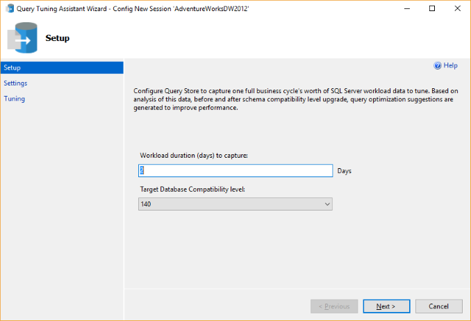
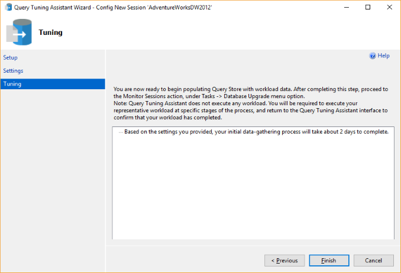
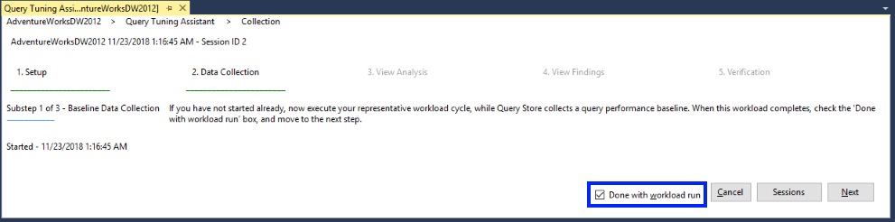
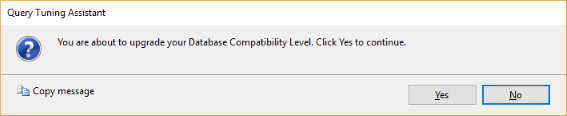
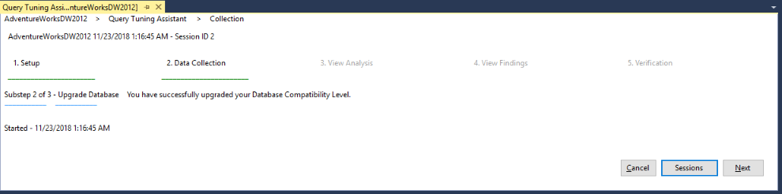
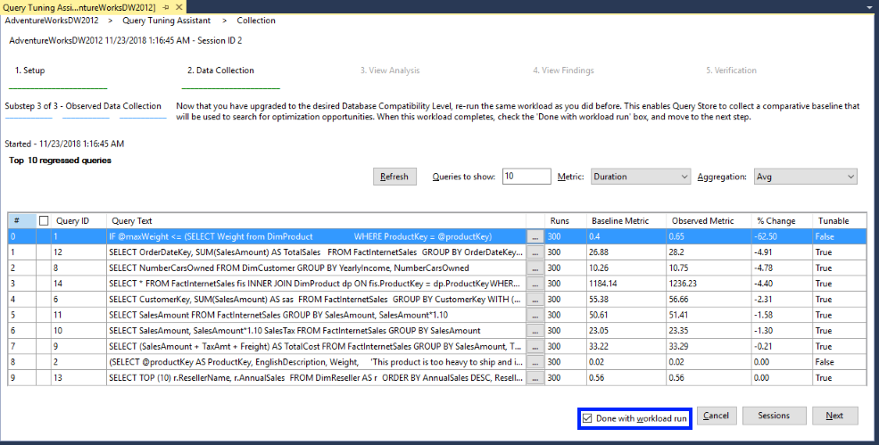
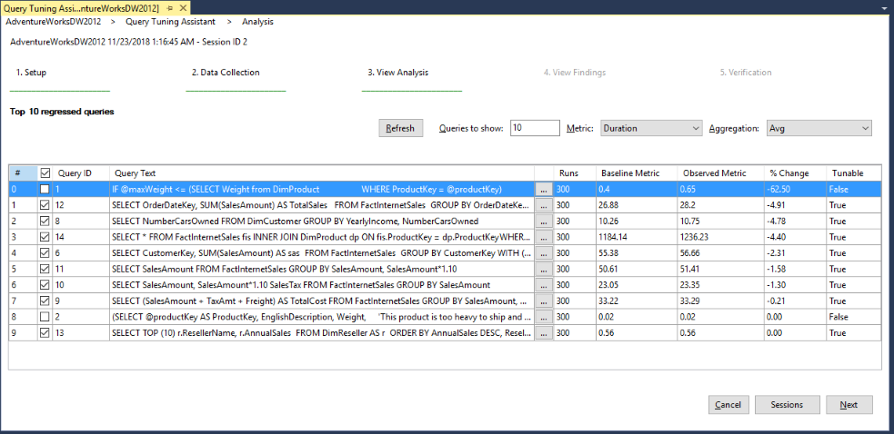
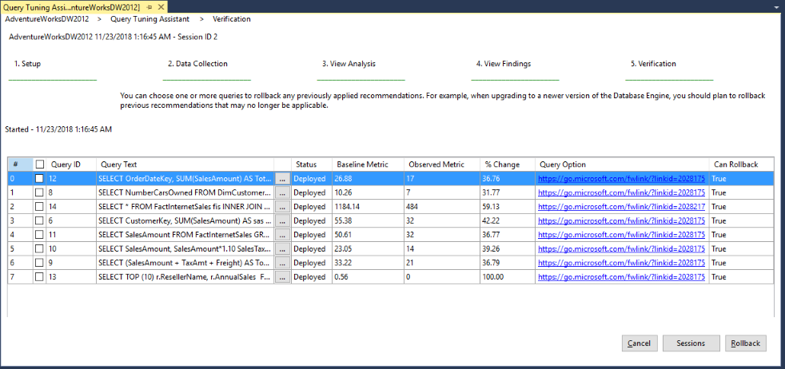
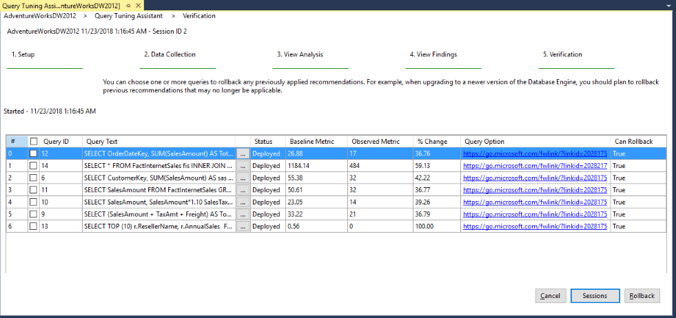

# Upgrading Database Compatibility Level using QTA Lab 

## Intro - Defining the problem and goal
When migrating from an older version of SQL Server and [upgrading the database compatibility level](https://docs.microsoft.com/sql/relational-databases/databases/view-or-change-the-compatibility-level-of-a-database) to the latest available, a workload may be exposed to the risk of performance regression. 

Starting with SQL Server 2016, all query optimizer changes are gated to the latest database compatibility level, which in combination with Query Store gives you a great level of control over the query performance in the upgrade process if the upgrade follows the recommended workflow seen below. 

 

This control over upgrades was further improved with SQL Server 2017 where [Automatic Tuning](https://docs.microsoft.com/sql/relational-databases/automatic-tuning/automatic-tuning.md) was introduced and allows automating the last step in the recommended workflow above.

Starting with SSMS v18, the new **Query Tuning Assistant (QTA)** feature will guide users through the recommended workflow to keep performance stability during database upgrades. See below how QTA essentially only changes the last steps of the recommended workflow for upgrading the compatibility level using Query Store seen above. Instead of having the option to choose between the currently inneficient execution plan and the last known good execution plan, QTA presents tuning options that are specific for the selected regressed queries, to create a new improved state with tuned execution plans.

> **Note:** 
> QTA does not generate user workload so users must ensure that a representative test workload can be executed on the target instance. 

## Lab requirements (pre-installed)
The following are requirements to run this lab:

- SQL Server 2016 or higher is installed.
- You have installed SQL Server Management Studio v18 Preview 5 or higher.
- You have installed the RML Utilities from https://www.microsoft.com/en-us/download/details.aspx?id=4511. Install ostress from the package *RML_Setup_AMD64.msi*. Add `C:\Program Files\Microsoft Corporation\RMLUtils` to your path variable.
- Restore the AdventureWorksDW2012 database to your SQL Server instance. The `AdventureWorksDW2012.bak` is available in https://github.com/Microsoft/sql-server-samples/releases/tag/adventureworks.

## Lab

### 1. Configure an upgrade session

1.  In SSMS, open the Object Explorer and connect to your local SQL Server instance.

2.  For the database that is intended to upgrade the database compatibility level (AdventureWorks2012DW), right-click the database name, select **Tasks**, select **Database Upgrade**, and click on **New Database Upgrade Session**.

3.  In the **Setup** window, configure Query Store to capture the equivalent of one full business cycle of worload data to analyze and tune. 
    -  Enter **1** as the expected workload duration in days (minimum is 1 day). This will be used to propose recommended Query Store settings to tentatively allow the entire baseline to be collected. Capturing a good baseline is important to ensure any regressed queries found after changing the database compatibility level are able to be analyzed. 
    -  Set the intended target database compatibility level to **140** or **150**. This is the setting that the user database should be at, after the QTA workflow has completed. 
    -  Once complete, click **Next**.
    
         
  
4.  In the **Settings** window, two columns show the **Current** state of Query Store in the targeted database, as well as the **Recommended** settings. Click on the **Recommended** button (if not selected by default). 

       

5.  The **Tuning** window concludes the session configuration, and instructs on next steps to open and proceed with the session. Once complete, click **Finish**.

    

### 2. Executing the database upgrade workflow
1.  For the database that is intended to upgrade the database compatibility level (AdventureWorks2012DW), right-click the database name, select **Tasks**, select **Database Upgrade**, and click on **Monitor Sessions**.

2.  The **session management** page lists current and past sessions for the database in scope. Select the desired session, and click on **Details**.
    
    

3.  The entry point for a new session is the **Data Collection** step. This step has 3 substeps:

    1.  **Baseline Data Collection** requests the user to run the representative workload cycle, so that Query Store can collect a baseline.    
        
        Open `C:\Labs\Lab-QTA\SCENARIO` and double-click the file `PreUpgrade.cmd` to execute it. Once that workload has completed, check the **Done with workload run** and click **Next**.   

        

    2.  **Upgrade Database** will prompt for permission to upgrade the database compatibility level to the desired target. To proceed to the next substep, click **Yes**.

        

        The following page confirms that the database compatibility level was successfully upgraded.

        

    3.  **Observed Data Collection** requests the user to re-run the representative workload cycle, so that Query Store can collect a comparative baseline that will be used to search for optimization opportunities. Open `C:\Labs\Lab-QTA\SCENARIO` and double-click the file `PostUpgrade.cmd` to execute it.    

        As the workload executes, use the **Refresh** button to keep updating the list of regressed queries. You can change the **Queries to show** value to limit the number of queries displayed. The order of the list is affected by the **Metric** (Duration or CpuTime) and the **Aggregation** (Average is default).    

        Once that workload has completed, check the **Done with workload run** and click **Next**.

        

        For each query, notice:
        - The columns **Baseline Metric** and **Observed Metric**: these show the performance difference between the pre-upgrade and post-upgrade status for the same workload.     
        - The **% Change** column, which shows the percentual change for the selected metric between the before and after database compatibility upgrade state. A negative number represents the amount of measured regression for the query.     
        - The **Tunable** column where you can see whether QTA can experiment on how to tune this query. Not all query types are eligible.

4.  **View Analysis** allows selection of which queries to experiment and find optimization opportunities. The **Queries to show** value becomes the scope of eligible queries to experiment on.     

    Check all queries that are Tunable, and click **Next** to start experimentation. A prompt advises that once QTA moves to the experimentation phase, returning to the View Analysis page will not be possible.

    

5.  After experimentation is complete, the **View Findings** allows selection of which queries to deploy the proposed optimization as a plan guide. 

    For each query, notice:
    - The columns **Baseline Metric** and **Observed Metric**: these show the performance difference between the post-upgrade and the after-experimentation status.
    - The **% Change** column, which shows the percentual change for the selected metric between the before and after-experimentation state, representing the amount of measured improvement for the query with the proposed optimization.
    - The **Query Option** column links to online documentation about the proposed hint that improves query execution metric.
    - The **Can Deploy** column where you can see whether the proposed query optimization can be deployed as a plan guide.

    Select all queries in this screen and click on **Deploy**.

    

6.  **Verification** shows the deployment status of previously selected queries for this session. The list in this page differs from the previous page by changing the **Can Deploy** column to **Can Rollback**.

    

    This allows users to rollback on a proposed optimization if the results in production differed from our experimentation.     
    
    Select a query and click **Rollback**. That query plan guide is removed and the list updated to remove the rolled back query. Note in the picture below that query 8 was removed.

     